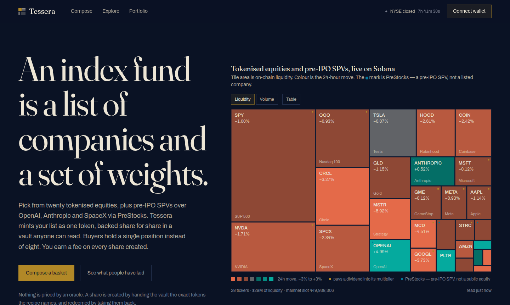
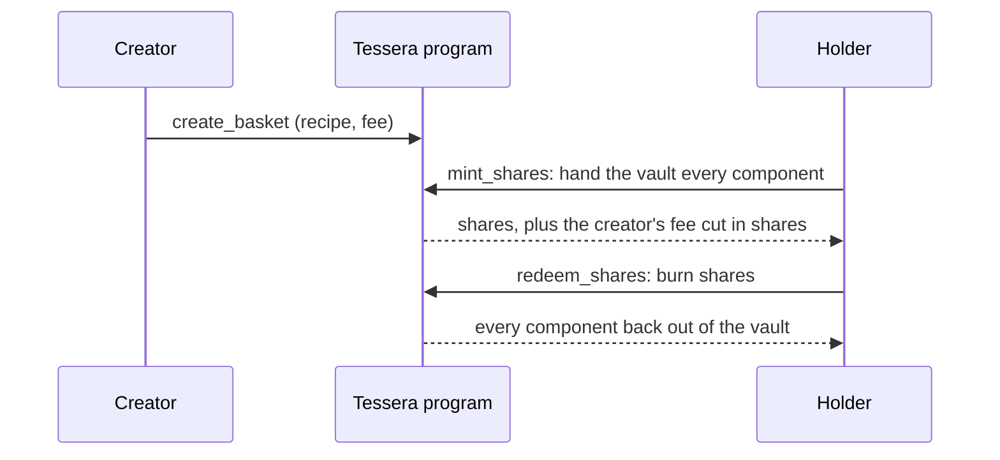
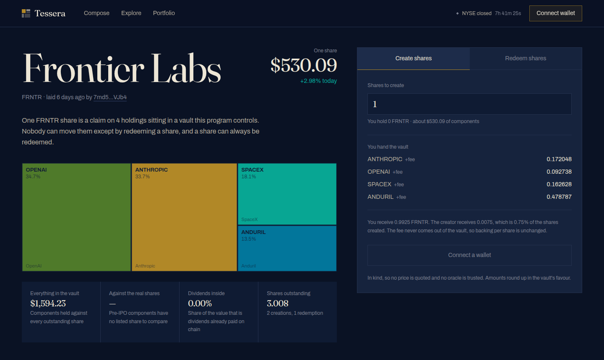

# Tessera

[](https://github.com/RohanGlitched/Tessera/actions/workflows/ci.yml)

**Anyone can launch an index fund on Solana. It takes one transaction, and nobody has to trust the person who launched it.**

**[Open the app](https://www.teserra.world)** · [Program on Solana Explorer](https://explorer.solana.com/address/F8QLTZPe9mJuPgXCbccnU9G2kMSEE4inygdUw3QZbrQ?cluster=devnet) · [Try it in two minutes](#try-it-in-two-minutes) · [Run it yourself](#run-it-yourself)



An index fund is two things: a list of companies and a set of weights. Tessera
turns those two things into a token.

Pick up to eight tokenised equities (xStocks such as Apple, NVIDIA and Tesla, or
pre-IPO PreStocks such as OpenAI, Anthropic and SpaceX), set their weights, and
Tessera writes that recipe into a Solana program. The program becomes the only
authority over a new share token. From then on:

- **One share is a claim on exact quantities of real tokens** held in a vault
  that anyone can read.
- **Anyone can create shares** by depositing the components, and **anyone can
  redeem** by burning shares and taking the components back.
- **No oracle, no manager, no edit button.** The recipe is fixed at creation, and
  the program has no instruction that lets the creator touch the vault.
- **The creator earns a fee of up to 1%** on every share created, paid in shares
  of their own basket, never out of the vault.





---

## Try it in two minutes

Everything below runs on devnet and costs nothing.

1. **Get a wallet on devnet.** Install [Phantom](https://phantom.app/download)
   (or any Solana wallet), then switch it to devnet. In Phantom: Settings →
   Developer settings → Testnet mode.
2. **Get free devnet SOL** for fees at [faucet.solana.com](https://faucet.solana.com).
   If your wallet has none, the app shows a banner with a copy-address button and
   a link to the faucet.
3. **Open [teserra.world](https://www.teserra.world)** and
   connect. The market on the home page is live mainnet data.
4. **Claim test tokens.** On [Portfolio](https://www.teserra.world/portfolio),
   press **Claim a starter set**, or press **Send me … of each** on any basket
   page when you are short of a component.
5. **Create shares in an existing basket.** Open one from
   [Explore](https://www.teserra.world/explore), for example
   [The Big Five](https://www.teserra.world/basket/6cUCq5GdhrdLGqJiy63iuc1epLFrEmAYQ45JvYEYGbg3),
   choose how many shares, and press **Create BIG5**. The vault holdings and the
   backing check update as soon as the transaction lands.
6. **Redeem them** from the same panel. Every component comes back to your wallet.
7. **Launch your own index fund.** On [Compose](https://www.teserra.world/compose),
   tap tiles (or pick from the Table view), drag the weights, name the token, set
   a creator fee and press **Lay the basket**. It gets its own page and its own
   link preview.

**[Portfolio](https://www.teserra.world/portfolio)** then looks through
everything you hold to the companies underneath, so three baskets that all
contain NVIDIA show up as one NVIDIA exposure.

---

## What is live and what runs on devnet

| | |
|---|---|
| Prices, 24-hour moves, liquidity, holders, dividend multipliers | **Solana mainnet, live** |
| The 28 tokenised equities you can compose | **Real xStocks by Backed Finance (20) and pre-IPO PreStocks (8)** |
| Creating and redeeming shares | **Devnet**, against mirror mints (see below) |
| The program's arithmetic | **10 integration tests, run in CI on every push** |

Every figure in the market mosaic, every premium against the listed share and
every dividend-accrual number is read from mainnet when the page loads.

**Why settlement uses mirror mints.** The xStocks exist only on mainnet, and a
program should hold real tokenised equities only after an audit. So devnet gets
a faithful mirror: one Token-2022 mint per ticker, with the same 8 decimals and a
`ScaledUiAmountConfig` seeded from the multiplier the real mint carries. The
program cannot tell the difference. Pointing Tessera at the real mints is a
change to one generated file.

---

## Why Solana

A blockchain lets four things happen in one transaction: **issuing a new
instrument, taking custody of its backing, settling the exchange, and letting
anyone verify the backing afterwards.** In traditional finance a fund
administrator does the first three and an auditor does the fourth, once a
quarter. Here the fourth is a balance read that anyone can make at any time, and
every basket page makes it on every load.

Solana in particular, for two reasons:

1. **Creation and redemption have to be cheap and immediate.** Arbitrage between
   a basket and its components is what keeps a fund tracking its holdings, and it
   only works if it settles before prices move. Fees of a fraction of a cent make
   a hundred-dollar basket worth creating.
2. **Token-2022 does real work here.** Tokenised equities pay dividends by raising
   a `ScaledUiAmountConfig` multiplier on the mint instead of transferring
   anything. A recipe written in displayed balances would come up short by exactly
   the dividends already accrued. Tessera stores recipes in raw units and applies
   the live multiplier when pricing, so a share redeems for the same raw amounts
   before and after a dividend while being worth more.

---

## Design decisions

**In kind, so there is no price to argue with.** Creating shares means handing
the vault the actual tokens in the recipe, and redeeming means taking them back.
The program never asks what anything is worth, so there is no oracle to go stale,
be manipulated or pay for. This is how a real ETF works, except that the right to
create and redeem usually belongs to a few authorised participants. Here it
belongs to anyone holding the tokens, and redemption works in any market,
because a share is always a claim on specific tokens in a specific vault.

**Rounding always favours the holders.** Every deposit rounds **up** and every
withdrawal rounds **down**, by at most one raw unit per component. As a result,
what the vault holds is always at least what the outstanding shares can claim, so
**backing per share never falls**. The basket page checks this on every load.

**The creator fee comes out of shares, never the vault.** The vault always
receives the full recipe, so the fee cannot dilute backing. A creator earns more
only by getting more people to create shares.

**Buying a basket with dollars, measured.** Creating shares in kind means
holding every component first. For someone starting with USDC, each basket page
has a **last mile** panel. It quotes every component through Jupiter, dollars in
and straight back out, and shows the round-trip cost with the venue for each leg.
On a live eight-component basket that is **0.17% for one share and 0.26% for a
hundred**. The panel measures the route against itself rather than against a price
feed, so the figure is exact. The arithmetic is in `web/lib/fill-cost.ts`.

---

## Sponsor tracks

### PreStocks: pre-IPO companies as basket components

Tessera also composes **PreStocks** ([prestocks.com](https://prestocks.com)):
Token-2022 SPVs over pre-IPO companies such as Anthropic, OpenAI, SpaceX, Anduril,
Figure AI, Kalshi, Neuralink and Polymarket. They are real mainnet mints with real
Jupiter liquidity, listed in `web/lib/prestocks.ts`.

Several of these mints carry a `TransferFeeConfig` extension, so every transfer
pays a fee at the token-program level. A naive deposit would leave the vault short
by exactly that fee. `gross_for_transfer_fee` in `programs/tessera/src/lib.rs`
reads the mint's live fee schedule at deposit time and grosses the transfer up,
so the vault nets exactly the recipe amount. The ninth test covers it, and it is
verified live on devnet:

- **Basket:** [`5Z8XUzGVJjcYPxPZ6Hfxx8uJRNKibFcmZd7yStuSPr1p`](https://www.teserra.world/basket/5Z8XUzGVJjcYPxPZ6Hfxx8uJRNKibFcmZd7yStuSPr1p),
  "Frontier Labs", four PreStocks components.
- **Creation tx:** [`4jNTjhUg…BAsbkz`](https://explorer.solana.com/tx/4jNTjhUgbGUu1eLhCXZmZrzZ8H9Mr1UXJH1stbSw1GVopVM22rdet7xHT5BTWhG6NHYtdoHn3LgHoyppkBAsBbkz?cluster=devnet)
- **On chain:** the ANTHROPIC vault holds `513564189` raw units, with `2580725`
  withheld as fee by Token-2022 itself: exactly 50 bps of the gross amount.

`scripts/setup-mirror-prestocks.mjs` mirrors the eight mints onto devnet with
their transfer fees intact. Compose, Portfolio and the basket page treat a
PreStock like any other component.

### Meteora DBC: a launch market for a new basket

A new basket has no shares and no liquidity yet. `scripts/dbc-launch.mjs` opens a
Meteora Dynamic Bonding Curve pool as a launch market for a real Tessera basket,
on the real DBC program (`dbcij3LWUppWqq96dh6gJWwBifmcGfLSB5D4DuSMaqN`, the same
address on devnet and mainnet). The pool is configured from the basket's own
numbers:

- **`initialMarketCap` and `migrationMarketCap`** are set at 0.5x and 20x the
  basket's NAV per share, converted to SOL at Jupiter's live price at launch.
- **`tokenAuthorityOption: Immutable`**, so the base mint has no upgrade path.
- **The fee scheduler decays from 4% to 1% over the first hour**, which deters
  snipers at the open.
- **Migrated liquidity is 100% permanently locked**, split evenly between
  partner and creator.

Verified live on devnet for the "Frontier Labs" basket:

- **Config:** `DqxXAWXXqurghukxhZmtridTj1nBobJSHG5aSBeYD5nu`
- **Pool:** [`DAZdm2LmiDCfVQaAuVkKdK5Qa1hWmkV1fNK6SzGikqFU`](https://explorer.solana.com/address/DAZdm2LmiDCfVQaAuVkKdK5Qa1hWmkV1fNK6SzGikqFU?cluster=devnet)
- **Base token (Token-2022):** `4A1rSrw6PoAVHg1AUfYfxs9nQzbF2ptY86caUuoJsULV`, "Frontier Labs, early access" (FRNTRA)
- **Creation tx:** [`3MDHtKoB…cua1MMgb`](https://explorer.solana.com/tx/3MDHtKoBXMSmrvhAXoCGXcnS32ekQy6x5udLhyKmE3xAXEe6xLZEv5a6XFZBmmEDiaYDKmgybQ1fp9mEcua1MMgb?cluster=devnet)
- **A real buy:** [`38KaZPY3…7QagfjzUxAni`](https://explorer.solana.com/tx/38KaZPY3tSVWxtk3xX9PkAqDqeubzAYXTV24hqNkGhuC59wQKBC4yXfZeRTS65tCa2Z2LgTtWaHg7QagfjzUxAni?cluster=devnet),
  0.01 SOL in, about 4.1M of the 990M curve supply out.

On the roadmap: letting the pool's migration fund the basket's first creation,
so early buyers roll straight into redeemable shares.

---

## The program

`programs/tessera/src/lib.rs`, Anchor 0.31.1, deployed on devnet at
[`F8QLTZPe9mJuPgXCbccnU9G2kMSEE4inygdUw3QZbrQ`](https://explorer.solana.com/address/F8QLTZPe9mJuPgXCbccnU9G2kMSEE4inygdUw3QZbrQ?cluster=devnet).
Its IDL is published on chain, so Solana Explorer decodes every Tessera
instruction by name.

| Instruction | What it does |
|---|---|
| `create_basket` | Validates the recipe and stores raw units per share for each component. The share mint must have 6 decimals, zero supply, no freeze authority, and the basket PDA as mint authority. The recipe can never be edited. |
| `mint_shares` | Moves each component from the caller into the basket's own vault (rounding up), then mints shares to the caller and the creator's fee cut. |
| `redeem_shares` | Burns shares and returns each component (rounding down). |

Limits: 1 to 8 components, weights must sum to 100%, a creator fee of at most 1%,
a name of up to 32 characters and a symbol of up to 10. Every vault must be the
basket's own associated token account, so a caller cannot substitute one they
control.

```
  tessera
    ✔ records the recipe it was given
    ✔ refuses a recipe whose weights do not add up
    ✔ refuses a creator fee above 1%
    ✔ takes the recipe in and issues shares, net of the creator fee
    ✔ keeps the vault fully backing every outstanding share
    ✔ hands the components back on redemption
    ✔ rejects a vault that is not the basket's own token account
    ✔ is unmoved by a dividend accruing into a component's multiplier
    ✔ grosses up a deposit so a transfer-fee component still nets the recipe amount
    ✔ still fully backs every share after all that

  10 passing
```

The eighth test raises a component's dividend multiplier mid-test and checks
that mint and redeem amounts are unchanged. The ninth is the transfer-fee case
for PreStocks.

---

## The app

Next.js 16 (App Router), React 19, Tailwind CSS v4 and the Solana wallet
adapter, which works with any Wallet Standard wallet (Phantom, Solflare,
Backpack and others).

| Route | What it does |
|---|---|
| `/` | The live market as a mosaic sized by on-chain liquidity, plus the baskets that exist |
| `/compose` | Pick companies, set weights, name the token and launch the basket |
| `/explore` | Every basket, with its backing proof and its premium to its own components |
| `/basket/[address]` | One basket: recipe, vault contents, backing check, create and redeem, and the cost of buying in with dollars |
| `/portfolio` | What you hold, what it is worth, and the companies underneath |
| `/method` | How it works and the reasoning behind each design choice |

Two API routes:
- `/api/market` batches the mainnet reads (Jupiter prices, plus supply and
  multipliers through `getMultipleAccounts`) behind a short shared cache.
- `/api/faucet` sends mirror tokens to a wallet so anyone can try creation
  without owning tokenised stocks.

Other details:
- **Transactions are sized to fit.** Solana caps a transaction at 1232 bytes.
  `packSteps` in `web/lib/tx.ts` measures each compiled message and splits an
  eight-component creation across two signatures when needed.
- **Accessible colour.** The red-to-green scale for 24-hour moves is generated by
  `scripts/build-diverging.mjs` and checked to stay distinguishable under common
  colour-vision deficiencies.
- **Lighthouse:** 100 for accessibility, best practices and SEO on every page.
- **Link previews.** Every basket gets its own preview card with its live price and
  holdings, drawn on the server.

---

## Run it yourself

### Option 1: the app against the live devnet program (about 2 minutes)

The repository already points at the deployed program and its devnet mirror mints.

Requires Node 22+ and pnpm.

```bash
git clone https://github.com/RohanGlitched/Tessera.git
cd Tessera/web
pnpm install
cp .env.example .env.local
pnpm build && pnpm start          # http://localhost:3000
```

Everything works locally except the test-token faucet, which needs the mirror
mints' authority key. To get test tokens, claim them once on the
[hosted app](https://www.teserra.world/portfolio). They land in your wallet
and work locally as well.

### Option 2: run the program tests

Requires Rust, the Solana CLI (Agave 4.x) and Anchor 0.31.1. This is the same job
CI runs.

```bash
pnpm install                        # at the repository root
solana-keygen new --no-bip39-passphrase   # skip if you already have ~/.config/solana/id.json
anchor keys sync                    # use a program ID your machine holds the key for
anchor test                         # starts a local validator, deploys, runs all 10 tests
```

`anchor keys sync` rewrites the program ID in `lib.rs` and `Anchor.toml` to your
own key. Run `git checkout programs Anchor.toml` afterwards to return to the
deployed ID.

### Option 3: deploy your own copy to devnet

```bash
anchor keys sync
./scripts/go-devnet.sh
node scripts/setup-mirror-prestocks.mjs --url devnet   # optional: the PreStocks mirrors
```

The script builds and deploys the program, creates the mirror mints (regenerating
`web/lib/mirror.generated.ts`), seeds a few baskets, and moves mint authority to
a separate faucet key. It writes `FAUCET_SECRET_KEY` into `web/.env.local`, so
your copy's faucet works, and prints the program ID to set there.

It needs about 3 SOL of devnet SOL on the deploy wallet. If the balance check
stops it, fund the printed address at [faucet.solana.com](https://faucet.solana.com)
and run it again. Every step is idempotent, and `scripts/lib/rpc.mjs` retries only
failures that prove a transaction never executed, so an interrupted run can simply
be restarted.

To use a local validator instead, run `solana-test-validator --reset`, then
`anchor deploy --provider.cluster localnet`, `node scripts/setup-mirror.mjs` and
`node scripts/seed-baskets.mjs`. Set `NEXT_PUBLIC_WRITE_CLUSTER=localnet` in
`web/.env.local`.

---

## Repository layout

```
programs/tessera/src/lib.rs          the program: create, mint, redeem
tests/tessera.ts                     10 integration tests, including the dividend and fee cases
web/                                 the Next.js app
web/lib/prestocks.ts                 the 8 PreStocks pre-IPO mints
web/lib/mirror.generated.ts          mainnet mint → devnet mirror mint, per ticker
scripts/go-devnet.sh                 one-command devnet deployment
scripts/setup-mirror.mjs             creates the xStock mirror mints
scripts/setup-mirror-prestocks.mjs   the same for PreStocks, transfer fee included
scripts/seed-baskets.mjs             a few example baskets
scripts/dbc-launch.mjs               opens a Meteora DBC pool sized from a basket's NAV
scripts/split-faucet-key.mjs         moves mint authority off the deploy wallet
scripts/lib/rpc.mjs                  safe retries against a rate-limited RPC
scripts/gen-universe.mjs             regenerates web/lib/universe.ts from mainnet
scripts/build-diverging.mjs          generates and checks the 24-hour-move colour scale
```

---

Not investment advice, and not an offer to sell anything. Tokenised equities are
issued by Backed Finance and PreStocks, and their token controls remain with
those issuers. Tessera does not issue or custody them beyond the vault a basket
writes to.
