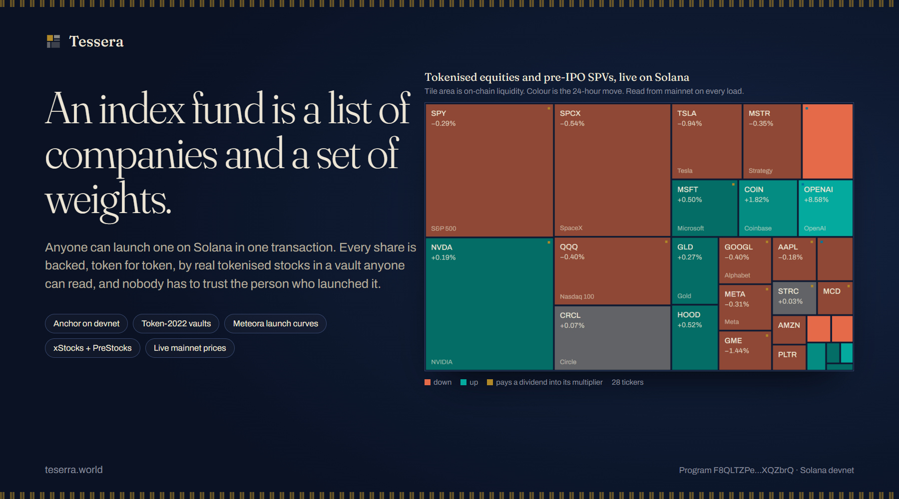
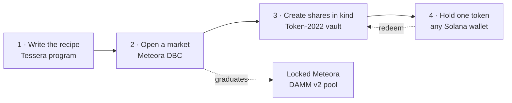
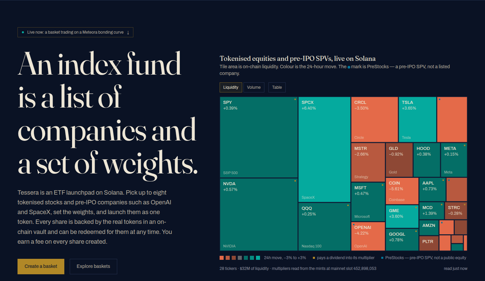
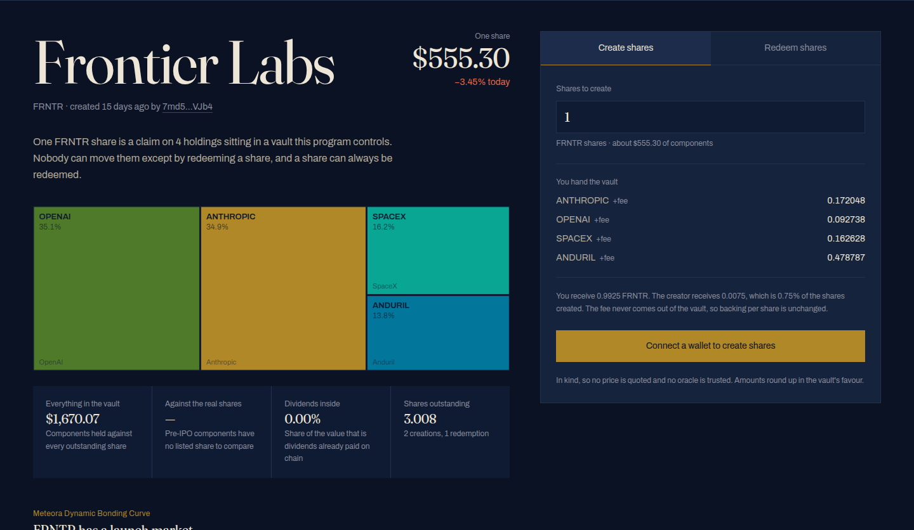
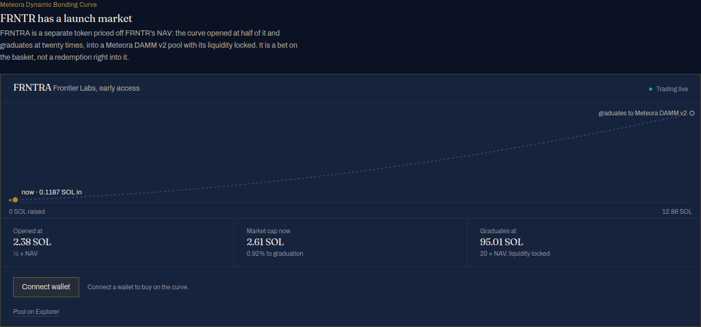
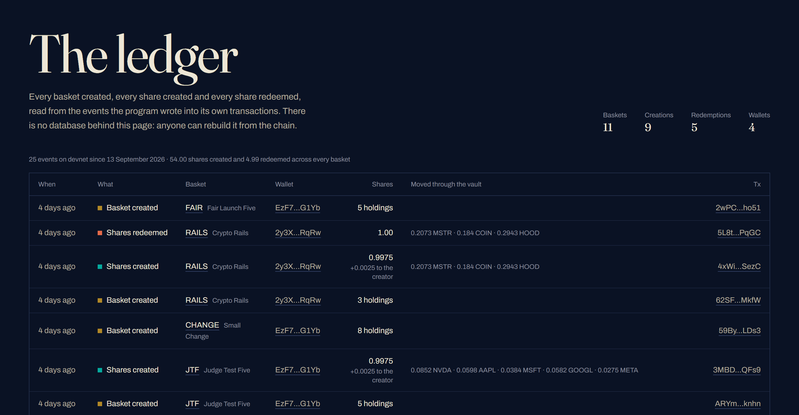
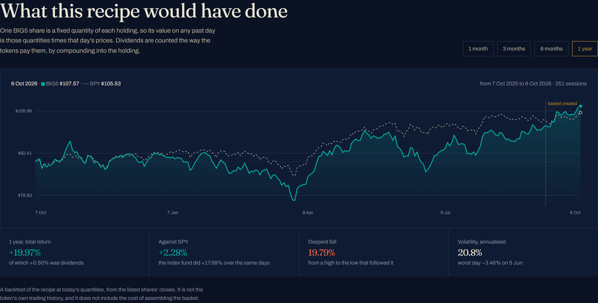

<div align="center">



<br>

[](https://github.com/RohanGlitched/Tessera/actions/workflows/ci.yml)
[](https://explorer.solana.com/address/F8QLTZPe9mJuPgXCbccnU9G2kMSEE4inygdUw3QZbrQ?cluster=devnet)
[](programs/tessera/src/lib.rs)
[](#why-solana)
[](#meteora-dbc-a-launch-market-for-every-basket)
[](web/)
[](LICENSE)

**[Open the app](https://www.teserra.world)** · **[Program on Solana Explorer](https://explorer.solana.com/address/F8QLTZPe9mJuPgXCbccnU9G2kMSEE4inygdUw3QZbrQ?cluster=devnet)** · **[How it works, in the app](https://www.teserra.world/method)**

**[Try it in two minutes](#try-it-in-two-minutes)** · **[What is live and what runs on devnet](#what-is-live-and-what-runs-on-devnet)** · **[Security](#security)** · **[Run it yourself](#run-it-yourself)**

</div>

---

**Anyone can launch an index fund on Solana. It takes one transaction, and nobody has to trust the person who launched it.**

An index fund is a list of companies and a set of weights. Tessera turns that
list into one token, backed share for share by real tokenised stocks in a vault
anyone can read. Prices, premiums and dividend multipliers are read from Solana
mainnet on every load; creation and redemption settle on devnet against faithful
mirror mints until the program is audited.

## How it works

A basket goes through four stages, and each one runs on a different part of Solana.


```mermaid
flowchart LR
  A["1 · Write the recipe<br/>Tessera program"] --> B["2 · Open a market<br/>Meteora DBC"]
  B --> C["3 · Create shares in kind<br/>Token-2022 vault"]
  C --> D["4 · Hold one token<br/>any Solana wallet"]
  D -. redeem .-> C
  B -. graduates .-> E["Locked Meteora<br/>DAMM v2 pool"]
```

1. **Write the recipe.** Pick up to eight tokenised equities: xStocks such as
   Apple, NVIDIA and Tesla, or PreStocks SPVs over OpenAI, Anthropic and SpaceX.
   `create_basket` stores the exact raw units per share and makes the program
   the only mint authority of a new share token. The recipe can never be edited.
2. **Open a market.** A new basket has no holders, and nobody wants to be the
   first to assemble every component. A Meteora Dynamic Bonding Curve opens in
   front of it, priced from the basket's own NAV: it starts at 0.5x and
   graduates at 20x into a Meteora DAMM v2 pool with all liquidity locked. The
   basket's creator opens it from the basket page in one signature and earns half
   the curve's trading fees. Anyone can buy on it, and anyone can graduate it
   once it fills.
3. **Create shares in kind.** `mint_shares` moves exactly the components the
   recipe names into the vault, and `redeem_shares` hands exactly that back. No
   oracle is read, so there is no price to push. PreStocks transfer fees are
   grossed up, so the vault never ends up short.
4. **Hold one token.** The share is an ordinary Token-2022 mint that transfers,
   sits in any wallet and can be sold. The creator earns up to 1% of every
   creation, paid in new shares and never out of the vault.

## Screens

| | |
|---|---|
|  |  |
| **Home.** The market as a mosaic: tile area is on-chain liquidity, colour the 24-hour move, every figure from mainnet. | **A basket.** The recipe, what the vault holds, the backing check, and create and redeem in kind. |



**A launch market.** The Meteora curve in front of a new basket, drawn from the pool config's own segments, with a buy and the creator's fee claim.



**The ledger.** Every creation and redemption the program has ever settled, decoded in the browser from the events in its own transaction logs.

---

## Try it in two minutes

Everything below runs on devnet and costs nothing.

1. **Open [teserra.world](https://www.teserra.world)** and connect any Solana
   wallet, such as [Phantom](https://phantom.app/download). The market on the
   home page is live mainnet data.
2. **Press Get free test SOL.** A new wallet gets a banner with one button that
   sends it 0.08 devnet SOL, enough to try everything below.
   [faucet.solana.com](https://faucet.solana.com) works too.
3. **Buy on a launch curve.** In the Meteora section of the
   [home page](https://www.teserra.world/#launch), pick an amount and press
   **Buy FRNTRA**. The dot on the curve moves with your buy.
4. **Claim test tokens.** On [Portfolio](https://www.teserra.world/portfolio),
   press **Claim a starter set**, or press **Send me … of each** on any basket
   page when you are short of a component.
5. **Create shares in an existing basket.** Open one from
   [Explore](https://www.teserra.world/explore), for example
   [The Big Five](https://www.teserra.world/basket/6cUCq5GdhrdLGqJiy63iuc1epLFrEmAYQ45JvYEYGbg3),
   choose how many shares, and press **Create BIG5**. The vault holdings and the
   backing check update as soon as the transaction lands.
6. **Redeem them** from the same panel. Every component comes back to your wallet.
7. **Launch your own index fund.** On [Create](https://www.teserra.world/compose),
   tap tiles (or pick from the Table view), drag the weights, name the token, set
   a creator fee and press **Create the basket**. It gets its own page and its own
   link preview.
8. **Open its launch market.** The next screen offers **Open the market**. One
   signature puts a Meteora curve in front of your basket, priced from its NAV.
   Claim your half of the trading fees from the same card.

**[Portfolio](https://www.teserra.world/portfolio)** then looks through
everything you hold to the companies underneath, so three baskets that all
contain NVIDIA show up as one NVIDIA exposure.

---

## What is live and what runs on devnet

| | |
|---|---|
| Prices, 24-hour moves, liquidity, holders | **Solana mainnet, live, via Jupiter** |
| Dividend multipliers and token supply | **Read from the mint accounts on mainnet, via Solami** |
| The 28 tokenised equities you can compose | **Real xStocks by Backed Finance (20) and pre-IPO PreStocks (8)** |
| Creating and redeeming shares | **Devnet**, against mirror mints (see below) |
| What a recipe would have done | **A year of daily closes of the listed shares**, read live with a committed snapshot as the fallback |
| Every basket's history | **Decoded in your browser from the program's own events**, no indexer, no database |
| The program's arithmetic | **11 integration tests, run in CI on every push**, one of them randomised |

Every figure in the market mosaic, every premium against the listed share and
every dividend-accrual number is read from mainnet when the page loads.

**Why settlement uses mirror mints.** The xStocks exist only on mainnet, and a
program should hold real tokenised equities only after an audit. So devnet gets
a faithful mirror: one Token-2022 mint per ticker, with the same 8 decimals and a
`ScaledUiAmountConfig` seeded from the multiplier the real mint carries. The
program cannot tell the difference. Pointing Tessera at the real mints is a
change to one generated file.

---

## How Tessera makes money

Nothing is charged for creating a basket or for creating and redeeming shares:
the creator fee is the creator's, in full. Revenue comes from the launch
markets, where the Tessera treasury is the Meteora partner on every curve:

- **Half of every curve's trading fees**, from the 4% opening fee down to the
  settled 1%. The basket's creator earns the other half.
- **1% of the SOL raised when a curve graduates**, taken as the migration fee.
- **Half of the graduated DAMM v2 pool's fees, for good**, because half of the
  migrated liquidity is permanently locked in a position the treasury owns.

Every basket that opens a launch market pays the treasury for as long as the
token trades, and the creator is paid alongside, which is why creators open
one.

---

## Security

What the program can and cannot do, and who holds which key.

- **The program never prices anything.** `mint_shares` and `redeem_shares`
  move the exact token units the recipe names, so there is no oracle to
  manipulate and no quote to front-run. Deposits round up and redemptions
  round down, so the vault can only ever hold at least what the outstanding
  shares claim.
- **A recipe cannot be edited.** `create_basket` writes the recipe once and
  takes the share mint's authority; the mint has no freeze authority, and no
  instruction changes a recipe, pauses a basket or withdraws from a vault.
  A creator's only ongoing power is receiving the fee cut.
- **PreStocks transfer fees are grossed up** on deposit, so a fee-bearing
  component cannot leave the vault short.
- **Launch tokens are immutable** (`tokenAuthorityOption: Immutable`), and
  100% of the liquidity that migrates to DAMM v2 is permanently locked. The
  keys that create a launch are derived from the basket's address and are
  public by design: they sign once, to create the accounts, and own nothing.
- **Keys.** The faucet key can only mint the devnet mirror tokens. The
  treasury key only claims fees. The deploy wallet still holds the program's
  upgrade authority, which is right for a devnet deployment that is still
  changing; a mainnet deployment would move it to a multisig and, later, burn
  it.
- **Tests and CI.** 11 integration tests cover creation, minting, redeeming,
  rounding, the fee cut and the dividend multiplier, and run on every push.
  One of them is a property test: forty random creations and redemptions,
  down to a single raw share unit, with every vault checked after each.
- **Not yet audited.** Tessera is on devnet and holds no real assets. It will
  not hold real tokenised equities before an audit.

---

## Why Solana

A blockchain lets four things happen in one transaction: **issuing a new
instrument, taking custody of its backing, settling the exchange, and letting
anyone verify the backing afterwards.** In traditional finance a fund
administrator does the first three and an auditor does the fourth, once a
quarter. Here the fourth is a balance read that anyone can make at any time, and
every basket page makes it on every load.

Solana in particular, for two reasons:

1. **Creation and redemption have to be cheap and immediate.** Arbitrage between
   a basket and its components is what keeps a fund tracking its holdings, and it
   only works if it settles before prices move. Fees of a fraction of a cent make
   a hundred-dollar basket worth creating.
2. **Token-2022 does real work here.** Tokenised equities pay dividends by raising
   a `ScaledUiAmountConfig` multiplier on the mint instead of transferring
   anything. A recipe written in displayed balances would come up short by exactly
   the dividends already accrued. Tessera stores recipes in raw units and applies
   the live multiplier when pricing, so a share redeems for the same raw amounts
   before and after a dividend while being worth more.

---

## Design decisions

**In kind, so there is no price to argue with.** Creating shares means handing
the vault the actual tokens in the recipe, and redeeming means taking them back.
The program never asks what anything is worth, so there is no oracle to go stale,
be manipulated or pay for. This is how a real ETF works, except that the right to
create and redeem usually belongs to a few authorised participants. Here it
belongs to anyone holding the tokens, and redemption works in any market,
because a share is always a claim on specific tokens in a specific vault.

**Rounding always favours the holders.** Every deposit rounds **up** and every
withdrawal rounds **down**, by at most one raw unit per component. As a result,
what the vault holds is always at least what the outstanding shares can claim, so
**backing per share never falls**. The basket page checks this on every load.

**The creator fee comes out of shares, never the vault.** The vault always
receives the full recipe, so the fee cannot dilute backing. A creator earns more
only by getting more people to create shares.

**Buying a basket with dollars, measured.** Creating shares in kind means
holding every component first. For someone starting with USDC, each basket page
has a **last mile** panel. It quotes every component through Jupiter, dollars in
and straight back out, and shows the round-trip cost with the venue for each leg.
On a live eight-component basket that is **0.17% for one share and 0.26% for a
hundred**. The panel measures the route against itself rather than against a price
feed, so the figure is exact. The arithmetic is in `web/lib/fill-cost.ts`.

---

## What a judge can check in a minute

Three things the product shows that an index launchpad usually asks you to
take on faith.

**What the recipe would have done.** Every basket page and the composer carry
a track record: the recipe's fixed quantities times each past day's price, so
the line ends exactly at today's value on chain, drawn against SPY over one
month to one year, with the deepest fall and the annualised volatility beside
it. In the composer it redraws as you drag a weight. Dividends are counted the
way the tokens pay them, by compounding into the holding, and the page says
how much of the return they were. Holdings with no listed share (the pre-IPO
PreStocks) are held flat and named, and a company listed after the range began
pulls the start of the chart forward rather than being invented. The arithmetic
is `web/lib/track.ts`; the closes come from `/api/history`.



**The ledger.** `/ledger` is every basket created, every share created and every
share redeemed, across the program's whole life, with the wallet, the size and
the raw units that moved through the vault. It is decoded in the browser from
the `Program data` lines of each transaction's log, using the event layouts the
program itself emits, so there is no indexer and no database to trust. Each
basket page shows its own slice.

**Check it without the page.** Under the backing table on every basket is a
disclosure with the exact RPC calls that reproduce it: `getTokenSupply` on the
share mint and `getTokenAccountBalance` on each vault, as copyable `curl`
commands, and the one inequality that has to hold between them.

---

## Sponsor tracks

### PreStocks: pre-IPO companies as basket components

Tessera also composes **PreStocks** ([prestocks.com](https://prestocks.com)):
Token-2022 SPVs over pre-IPO companies such as Anthropic, OpenAI, SpaceX, Anduril,
Figure AI, Kalshi, Neuralink and Polymarket. They are real mainnet mints with real
Jupiter liquidity, listed in `web/lib/prestocks.ts`.

Several of these mints carry a `TransferFeeConfig` extension, so every transfer
pays a fee at the token-program level. A naive deposit would leave the vault short
by exactly that fee. `gross_for_transfer_fee` in `programs/tessera/src/lib.rs`
reads the mint's live fee schedule at deposit time and grosses the transfer up,
so the vault nets exactly the recipe amount. The ninth test covers it, and it is
verified live on devnet:

- **Basket:** [`5Z8XUzGVJjcYPxPZ6Hfxx8uJRNKibFcmZd7yStuSPr1p`](https://www.teserra.world/basket/5Z8XUzGVJjcYPxPZ6Hfxx8uJRNKibFcmZd7yStuSPr1p),
  "Frontier Labs", four PreStocks components.
- **Creation tx:** [`4jNTjhUg…BAsbkz`](https://explorer.solana.com/tx/4jNTjhUgbGUu1eLhCXZmZrzZ8H9Mr1UXJH1stbSw1GVopVM22rdet7xHT5BTWhG6NHYtdoHn3LgHoyppkBAsBbkz?cluster=devnet)
- **On chain:** the ANTHROPIC vault holds `513564189` raw units, with `2580725`
  withheld as fee by Token-2022 itself: exactly 50 bps of the gross amount.

`scripts/setup-mirror-prestocks.mjs` mirrors the eight mints onto devnet with
their transfer fees intact. Compose, Portfolio and the basket page treat a
PreStock like any other component.

### Meteora DBC: a launch market for every basket

A new basket has no shares and no liquidity yet. Tessera is a launchpad on
Meteora's Dynamic Bonding Curve (`dbcij3LWUppWqq96dh6gJWwBifmcGfLSB5D4DuSMaqN`,
the same address on devnet and mainnet): the creator of any basket opens a launch
market for it from the basket page, and the whole lifecycle runs in the app.

- **Priced from the basket, not a round number.** `initialMarketCap` and
  `migrationMarketCap` are 0.5x and 20x the basket's NAV per share, converted to
  SOL at Jupiter's live price when the market opens.
- **A curve with an opening shelf.** `buildCurveWithCustomSqrtPrices` with
  breakpoints at 1×, 1.26×, 2×, 6.3× and 40× the opening cap and liquidity
  weights `[16, 6, 2, 1]`: the first fifth of the SOL raised moves the price
  less than a quarter above the open, half the raise is in before the price
  reaches a sixth of graduation, then it steepens. Early buyers of a basket are
  not punished for being early. Four segments, so the config and the pool
  still fit in one transaction.
  The chart on every basket page is drawn from the pool config's own segments,
  so it shows the real shape, not an illustration.
- **One launch per basket, found without an indexer.** The config and base-mint
  keys are derived from the basket's address (`launchKeys` in `web/lib/dbc.ts`),
  so the pool address follows from the basket alone. Explore marks every basket
  with a live launch using one batched account read.
- **Fees shared between creator and platform.** `creatorTradingFeePercentage` is
  50: the basket's creator claims their half from the launch card, and Tessera's
  treasury is the partner `feeClaimer`. The fee scheduler decays from 4% to 1%
  over the first hour to deter snipers.
- **Nothing to rug.** `tokenAuthorityOption: Immutable`, and 100% of migrated
  liquidity is permanently locked, split between partner and creator.
- **Buy and sell, before and after graduation.** On the curve, buys use DBC
  `swap2` in `PartialFill` mode, so the last buy fills the curve and refunds
  the rest, and sells are exact-in. Once the curve fills, anyone can press
  **Graduate to Meteora DAMM v2**, which calls `migrateToDammV2`; the same card
  then trades on the DAMM v2 pool through `@meteora-ag/cp-amm-sdk`, and reads
  the market cap from that pool's own price. One token, one market in the app,
  across the whole lifecycle (`web/lib/trade.ts`).
- **Creators keep earning after graduation.** Graduation locks half the DAMM v2
  liquidity in a position the creator owns and half in one the treasury owns.
  The card reads each position's unclaimed fees with `getUnClaimLpFee` and
  claims them with `claimPositionFee`.

The full lifecycle, run through the app on devnet for the "Small Change" basket:

- **Opened:** [`5dTLYrrx…eCZfe6`](https://explorer.solana.com/tx/5dTLYrrxpfRZ8mdv78M7sBxTzdn3Fue7VydnkoKb9vQhh5RMhx1ZsFS77dAvJxKcLLudmqZS6syneeavnyeCZfe6?cluster=devnet), config and Token-2022 pool in one signature
- **Bought:** [`2qT9Vp2F…CqF1pL`](https://explorer.solana.com/tx/2qT9Vp2FVU68K8QNsQCcZvKNaryE8Xn7GFccLFSLWarNwFAQAVvvWeHUFgSyyoWeJ3nB4bypAbwe2wdosNCqF1pL?cluster=devnet), then a partial fill to the top: [`2W8DAX1E…8qU2sby`](https://explorer.solana.com/tx/2W8DAX1EF7DA9tQZ8fz6VhfjPxuLuUNuxY7GypmzdU3APMop8yaE57HF6dJfSWSF2WY7uyGzf8DZwh23i8qU2sby?cluster=devnet)
- **Graduated:** [`2axtjcWU…oeHez5mE`](https://explorer.solana.com/tx/2axtjcWUPAR5vV1LR38kJsqA83YGHVMQUPREkppaPAyMD4i9QfTeVKWL4J8mqSmngSJq6ehaHA4aDGXgoeHez5mE?cluster=devnet) into DAMM v2 pool [`CU2TWUHw…LfiKJu`](https://explorer.solana.com/address/CU2TWUHwD4kfcFJY5Say2DRm6xuM1H4vFzxGDQLfiKJu?cluster=devnet)

The curves on the site are read straight from the pool and config accounts
(`readDbcState` in `web/lib/dbc.ts`), and every transaction is built with the
Meteora SDK in the browser (`web/lib/launch.ts`, `web/components/launch-market.tsx`).
The first launch, "Frontier Labs, early access" (FRNTRA, pool
[`DAZdm2Lm…GikqFU`](https://explorer.solana.com/address/DAZdm2LmiDCfVQaAuVkKdK5Qa1hWmkV1fNK6SzGikqFU?cluster=devnet)),
was opened by `scripts/dbc-launch.mjs` and is the one on the home page.

On the roadmap: letting a graduated pool fund the basket's first creation, so
early buyers roll straight into redeemable shares.

### Solami: mainnet reads straight from the mints

Every basket is valued by its components' dividend multipliers, and a multiplier
lives in the Token-2022 `ScaledUiAmountConfig` extension of each mint account.
`/api/market` reads all 28 mint accounts in one `getMultipleAccounts` call through
Solami's mainnet RPC (`web/lib/mainnet.ts`), unpacks the extension, and applies a
scheduled multiplier step once its time has passed. Those values replace the
aggregator's copy before anything is priced, and each token's value on Solana is
computed as on-chain supply × multiplier × price. The home page footer shows the
mainnet slot the mints were read at. The key stays on the server.

---

## The program

`programs/tessera/src/lib.rs`, Anchor 0.31.1, deployed on devnet at
[`F8QLTZPe9mJuPgXCbccnU9G2kMSEE4inygdUw3QZbrQ`](https://explorer.solana.com/address/F8QLTZPe9mJuPgXCbccnU9G2kMSEE4inygdUw3QZbrQ?cluster=devnet).
Its IDL is published on chain, so Solana Explorer decodes every Tessera
instruction by name.

| Instruction | What it does |
|---|---|
| `create_basket` | Validates the recipe and stores raw units per share for each component. The share mint must have 6 decimals, zero supply, no freeze authority, and the basket PDA as mint authority. The recipe can never be edited. |
| `mint_shares` | Moves each component from the caller into the basket's own vault (rounding up), then mints shares to the caller and the creator's fee cut. |
| `redeem_shares` | Burns shares and returns each component (rounding down). |

Limits: 1 to 8 components, weights must sum to 100%, a creator fee of at most 1%,
a name of up to 32 characters and a symbol of up to 10. Every vault must be the
basket's own associated token account, so a caller cannot substitute one they
control.

```
  tessera
    ✔ records the recipe it was given
    ✔ refuses a recipe whose weights do not add up
    ✔ refuses a creator fee above 1%
    ✔ takes the recipe in and issues shares, net of the creator fee
    ✔ keeps the vault fully backing every outstanding share
    ✔ hands the components back on redemption
    ✔ rejects a vault that is not the basket's own token account
    ✔ is unmoved by a dividend accruing into a component's multiplier
    ✔ grosses up a deposit so a transfer-fee component still nets the recipe amount
    ✔ stays backed through forty random creations and redemptions
    ✔ still fully backs every share after all that

  11 passing
```

The eighth test raises a component's dividend multiplier mid-test and checks
that mint and redeem amounts are unchanged. The ninth is the transfer-fee case
for PreStocks. The tenth is a property rather than an example: a seeded
generator picks forty creations and redemptions of random size, down to one
raw share unit where rounding bites hardest, and after each one every vault is
checked against what the outstanding shares can claim.

---

## The app

Next.js 16 (App Router), React 19, Tailwind CSS v4 and the Solana wallet
adapter, which works with any Wallet Standard wallet (Phantom, Solflare,
Backpack and others).

| Route | What it does |
|---|---|
| `/` | The live market as a mosaic sized by on-chain liquidity, the life of a basket, the Meteora launch curve you can buy on, and the baskets that exist |
| `/compose` | Pick companies, set weights, name the token and launch the basket |
| `/explore` | Every basket, with its backing proof and its premium to its own components |
| `/basket/[address]` | One basket: recipe, vault contents, backing check, create and redeem, its Meteora launch market, and the cost of buying in with dollars |
| `/portfolio` | What you hold, what it is worth, and the companies underneath |
| `/ledger` | Every basket created, every share created and every share redeemed, decoded in the browser from the program's events |
| `/method` | How it works and the reasoning behind each design choice |
| `/api/launches` | JSON: every basket's Meteora launch market, with SOL raised, market cap, fees and the curve's own segments, read from the pool accounts |
| `/api/market` | JSON: the 28 tokenised equities with live prices and the dividend multipliers read from their mints |
| `/api/history` | JSON: a year of daily closes for every listed company in the universe, plus the benchmark, which every track record is computed from |

Two API routes:
- `/api/market` batches the mainnet reads (Jupiter prices, plus supply and
  multipliers through `getMultipleAccounts`) behind a short shared cache.
- `/api/faucet` sends mirror tokens to a wallet so anyone can try creation
  without owning tokenised stocks.

Other details:
- **Transactions are sized to fit.** Solana caps a transaction at 1232 bytes.
  `packSteps` in `web/lib/tx.ts` measures each compiled message and splits an
  eight-component creation across two signatures when needed.
- **Accessible colour.** The red-to-green scale for 24-hour moves is generated by
  `scripts/build-diverging.mjs` and checked to stay distinguishable under common
  colour-vision deficiencies.
- **Lighthouse:** 100 for accessibility, best practices and SEO on every page.
- **Link previews.** Every basket gets its own preview card with its live price and
  holdings, drawn on the server.

---

## Run it yourself

### Option 1: the app against the live devnet program (about 2 minutes)

The repository already points at the deployed program and its devnet mirror mints.

Requires Node 22+ and pnpm.

```bash
git clone https://github.com/RohanGlitched/Tessera.git
cd Tessera/web
pnpm install
cp .env.example .env.local
pnpm build && pnpm start          # http://localhost:3000
```

To read mainnet through Solami, put a free key from [solami.dev](https://solami.dev)
in `SOLAMI_API_KEY` in `.env.local`; without one the app falls back to the public
mainnet endpoint.

Everything works locally except the test-token faucet, which needs the mirror
mints' authority key. To get test tokens, claim them once on the
[hosted app](https://www.teserra.world/portfolio). They land in your wallet
and work locally as well.

### Option 2: run the program tests

Requires Rust, the Solana CLI (Agave 4.x) and Anchor 0.31.1. This is the same job
CI runs.

```bash
pnpm install                        # at the repository root
solana-keygen new --no-bip39-passphrase   # skip if you already have ~/.config/solana/id.json
anchor keys sync                    # use a program ID your machine holds the key for
anchor test                         # starts a local validator, deploys, runs all 11 tests
```

`anchor keys sync` rewrites the program ID in `lib.rs` and `Anchor.toml` to your
own key. Run `git checkout programs Anchor.toml` afterwards to return to the
deployed ID.

### Option 3: deploy your own copy to devnet

```bash
anchor keys sync
./scripts/go-devnet.sh
node scripts/setup-mirror-prestocks.mjs --url devnet   # optional: the PreStocks mirrors
```

The script builds and deploys the program, creates the mirror mints (regenerating
`web/lib/mirror.generated.ts`), seeds a few baskets, and moves mint authority to
a separate faucet key. It writes `FAUCET_SECRET_KEY` into `web/.env.local`, so
your copy's faucet works, and prints the program ID to set there.

It needs about 3 SOL of devnet SOL on the deploy wallet. If the balance check
stops it, fund the printed address at [faucet.solana.com](https://faucet.solana.com)
and run it again. Every step is idempotent, and `scripts/lib/rpc.mjs` retries only
failures that prove a transaction never executed, so an interrupted run can simply
be restarted.

To use a local validator instead, run `solana-test-validator --reset`, then
`anchor deploy --provider.cluster localnet`, `node scripts/setup-mirror.mjs` and
`node scripts/seed-baskets.mjs`. Set `NEXT_PUBLIC_WRITE_CLUSTER=localnet` in
`web/.env.local`.

---

## Repository layout

```
programs/tessera/src/lib.rs          the program: create, mint, redeem
tests/tessera.ts                     11 integration tests, including the dividend, fee and random-order cases
web/                                 the Next.js app
web/lib/track.ts                     the track record: a recipe's value on every past day, from the listed shares' closes
web/lib/history.ts                   a year of daily closes per ticker, read live with history.snapshot.json as the fallback
web/lib/ledger.ts                    the program's events, decoded from transaction logs in the browser
web/lib/prestocks.ts                 the 8 PreStocks pre-IPO mints
web/lib/mirror.generated.ts          mainnet mint → devnet mirror mint, per ticker
web/lib/dbc.ts                       where each basket's launch lives, read straight from the accounts
web/lib/launch.ts                    the transaction that opens a launch market
web/lib/trade.ts                     buys and sells on the curve, then on DAMM v2
web/lib/mainnet.ts                   mint accounts read from mainnet through Solami
web/app/api/launches/route.ts        every launch market as JSON, for terminals
scripts/go-devnet.sh                 one-command devnet deployment
scripts/setup-mirror.mjs             creates the xStock mirror mints
scripts/setup-mirror-prestocks.mjs   the same for PreStocks, transfer fee included
scripts/seed-baskets.mjs             a few example baskets
scripts/dbc-launch.mjs               opened the first launch (FRNTRA) before launches moved into the app
scripts/split-faucet-key.mjs         moves mint authority off the deploy wallet
scripts/lib/rpc.mjs                  safe retries against a rate-limited RPC
scripts/gen-universe.mjs             regenerates web/lib/universe.ts from mainnet
scripts/snapshot-history.mjs         rewrites web/lib/history.snapshot.json, the fallback for the track record
scripts/build-diverging.mjs          generates and checks the 24-hour-move colour scale
```

---

Not investment advice, and not an offer to sell anything. Tokenised equities are
issued by Backed Finance and PreStocks, and their token controls remain with
those issuers. Tessera does not issue or custody them beyond the vault a basket
writes to.
